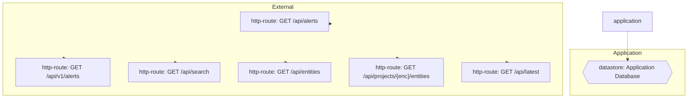

# Threat Model (auto-generated)

Generated by agentic-security on 2026-06-19.

This threat model is derived from static analysis of the current codebase and is regenerated on every scan. It is intended as a working artifact, not a finished compliance document.

## Entities + boundaries

## Assets

- **datastore**: Application Database — at `(global)`

## STRIDE threats

### Tampering (25)

- [medium] **crypto-tls-no-verify** (CWE-295) at `darkwatch-osint/run.py:81` — TLS certificate verification disabled — MITM-vulnerable
- [medium] **crypto-tls-no-verify** (CWE-295) at `intrigue/run.py:57` — TLS certificate verification disabled — MITM-vulnerable
- [medium] **crypto-tls-no-verify** (CWE-295) at `rudder/run.py:83` — TLS certificate verification disabled — MITM-vulnerable
- [medium] **sql-injection** (CWE-89) at `runner.py:216` — SQL Injection — cursor.execute built with string concat / format (Python)
- [medium] **sql-injection** (CWE-89) at `runner.py:108` — SQL Injection — cursor.execute built with string concat / format (Python)
- [medium] **sql-injection** (CWE-89) at `runner.py:380` — SQL Injection — cursor.execute built with string concat / format (Python)
- [medium] **sql-injection** (CWE-89) at `runner.py:384` — SQL Injection — cursor.execute built with string concat / format (Python)
- [medium] **weak-password-hash** (CWE-916) at `scoptix/run.py:120` — Weak Password Hashing — hashlib.md5/sha1 for password without salt
- [low] **sql-injection** (CWE-89) at `runner.py:55` — SQL Injection (f-string SQL assigned to variable)
- [low] **sql-injection** (CWE-89) at `runner.py:467` — SQL Injection (f-string SQL assigned to variable)
- [low] **sql-injection** (CWE-89) at `qradar/run.py:44` — SQL Injection (f-string SQL assigned to variable)
- [low] **toctou-file-existence-permission-check-b** (CWE-367) at `gen_readmes.py:178` — TOCTOU: file existence/permission check before open
- [low] **toctou-file-existence-permission-check-b** (CWE-367) at `gen_readmes.py:187` — TOCTOU: file existence/permission check before open
- [low] **toctou-file-existence-permission-check-b** (CWE-367) at `runner.py:230` — TOCTOU: file existence/permission check before open
- [low] **toctou-file-existence-permission-check-b** (CWE-367) at `_osint.py:112` — TOCTOU: file existence/permission check before open
- [low] **toctou-file-existence-permission-check-b** (CWE-367) at `amass/run.py:37` — TOCTOU: file existence/permission check before open
- [low] **toctou-file-existence-permission-check-b** (CWE-367) at `jaeles/parse_jaeles.py:29` — TOCTOU: file existence/permission check before open
- [low] **toctou-file-existence-permission-check-b** (CWE-367) at `lyra/run.py:83` — TOCTOU: file existence/permission check before open
- [low] **toctou-file-existence-permission-check-b** (CWE-367) at `nuclei/parse_nuclei.py:23` — TOCTOU: file existence/permission check before open
- [low] **path-normalization** (CWE-176) at `pentesterflow-agent/run.py:63` — Path Normalization Gap — extension extraction without null-byte/traversal sanitization
- [low] **toctou-file-existence-permission-check-b** (CWE-367) at `security-suite/run.py:60` — TOCTOU: file existence/permission check before open
- [low] **toctou-file-existence-permission-check-b** (CWE-367) at `sn1per/parse_sn1per.py:27` — TOCTOU: file existence/permission check before open
- [low] **toctou-file-existence-permission-check-b** (CWE-367) at `theharvester/run.py:40` — TOCTOU: file existence/permission check before open
- [low] **toctou-file-existence-permission-check-b** (CWE-367) at `trivy/run.py:41` — TOCTOU: file existence/permission check before open
- [low] **toctou-file-existence-permission-check-b** (CWE-367) at `wpprobe/run.py:52` — TOCTOU: file existence/permission check before open

### Information Disclosure (41)

- [low] **crypto-weak-hash** (CWE-327) at `darkwatch-osint/run.py:230` — Weak hash algorithm (MD5 / SHA-1 / MD2 / MD4) used
- [medium] **sql-injection** (CWE-89) at `runner.py:216` — SQL Injection — cursor.execute built with string concat / format (Python)
- [medium] **sql-injection** (CWE-89) at `runner.py:108` — SQL Injection — cursor.execute built with string concat / format (Python)
- [medium] **sql-injection** (CWE-89) at `runner.py:380` — SQL Injection — cursor.execute built with string concat / format (Python)
- [medium] **sql-injection** (CWE-89) at `runner.py:384` — SQL Injection — cursor.execute built with string concat / format (Python)
- [low] **sql-injection** (CWE-89) at `runner.py:55` — SQL Injection (f-string SQL assigned to variable)
- [low] **sql-injection** (CWE-89) at `runner.py:467` — SQL Injection (f-string SQL assigned to variable)
- [low] **ssrf** (CWE-918) at `runner.py:816` — SSRF (requests with user-controlled URL)
- [low] **ssrf** (CWE-918) at `runner.py:842` — SSRF (requests with user-controlled URL)
- [low] **ssrf** (CWE-918) at `aikido/run.py:49` — SSRF (requests with user-controlled URL)
- [low] **ssrf** (CWE-918) at `aikido/run.py:63` — SSRF (requests with user-controlled URL)
- [low] **ssrf** (CWE-918) at `burpsuite/run.py:58` — SSRF (requests with user-controlled URL)
- [low] **ssrf** (CWE-918) at `caldera/run.py:40` — SSRF (requests with user-controlled URL)
- [low] **ssrf** (CWE-918) at `dependency-track/run.py:68` — SSRF (requests with user-controlled URL)
- [low] **ssrf** (CWE-918) at `dependency-track/run.py:74` — SSRF (requests with user-controlled URL)
- [low] **ssrf** (CWE-918) at `dependency-track/run.py:80` — SSRF (requests with user-controlled URL)
- [low] **ssrf** (CWE-918) at `elastic-security/run.py:59` — SSRF (requests with user-controlled URL)
- [low] **xxe** (CWE-611) at `gcti/run.py:82` — XXE: xml.etree.ElementTree parses XML without external-entity protections
- [low] **ssrf** (CWE-918) at `lacework/run.py:45` — SSRF (requests with user-controlled URL)
- [low] **ssrf** (CWE-918) at `lacework/run.py:63` — SSRF (requests with user-controlled URL)
- [low] **xxe** (CWE-611) at `metasploit/run.py:23` — XXE: xml.etree.ElementTree parses XML without external-entity protections
- [low] **xxe** (CWE-611) at `nessus/run.py:24` — XXE: xml.etree.ElementTree parses XML without external-entity protections
- [low] **xxe** (CWE-611) at `nmap/parse_nmap.py:34` — XXE: xml.etree.ElementTree parses XML without external-entity protections
- [low] **xxe** (CWE-611) at `nmap/parse_nmap.py:35` — XXE: xml.etree.ElementTree parses XML without external-entity protections
- [low] **xxe** (CWE-611) at `openvas/run.py:33` — XXE: xml.etree.ElementTree parses XML without external-entity protections
- … and 16 more

### Elevation of Privilege (19)

- [low] **ssrf** (CWE-918) at `runner.py:816` — SSRF (requests with user-controlled URL)
- [low] **ssrf** (CWE-918) at `runner.py:842` — SSRF (requests with user-controlled URL)
- [low] **ssrf** (CWE-918) at `aikido/run.py:49` — SSRF (requests with user-controlled URL)
- [low] **ssrf** (CWE-918) at `aikido/run.py:63` — SSRF (requests with user-controlled URL)
- [low] **ssrf** (CWE-918) at `burpsuite/run.py:58` — SSRF (requests with user-controlled URL)
- [low] **ssrf** (CWE-918) at `caldera/run.py:40` — SSRF (requests with user-controlled URL)
- [low] **ssrf** (CWE-918) at `dependency-track/run.py:68` — SSRF (requests with user-controlled URL)
- [low] **ssrf** (CWE-918) at `dependency-track/run.py:74` — SSRF (requests with user-controlled URL)
- [low] **ssrf** (CWE-918) at `dependency-track/run.py:80` — SSRF (requests with user-controlled URL)
- [low] **ssrf** (CWE-918) at `elastic-security/run.py:59` — SSRF (requests with user-controlled URL)
- [low] **ssrf** (CWE-918) at `lacework/run.py:45` — SSRF (requests with user-controlled URL)
- [low] **ssrf** (CWE-918) at `lacework/run.py:63` — SSRF (requests with user-controlled URL)
- [low] **ssrf** (CWE-918) at `qradar/run.py:39` — SSRF (requests with user-controlled URL)
- [low] **ssrf** (CWE-918) at `qualys/run.py:31` — SSRF (requests with user-controlled URL)
- [low] **ssrf** (CWE-918) at `rapid7/run.py:37` — SSRF (requests with user-controlled URL)
- [low] **ssrf** (CWE-918) at `rapid7/run.py:51` — SSRF (requests with user-controlled URL)
- [low] **ssrf** (CWE-918) at `sentinel/run.py:42` — SSRF (requests with user-controlled URL)
- [low] **ssrf** (CWE-918) at `splunk/run.py:38` — SSRF (requests with user-controlled URL)
- [low] **ssrf** (CWE-918) at `sysdig/run.py:46` — SSRF (requests with user-controlled URL)

## Attack trees

### Compromise datastore: Application Database
Severity rollup: **medium**

- [medium] Tampering via sql-injection (CWE-89) — `runner.py:216`
- [medium] Information Disclosure via sql-injection (CWE-89) — `runner.py:216`
- [medium] Tampering via sql-injection (CWE-89) — `runner.py:108`
- [medium] Information Disclosure via sql-injection (CWE-89) — `runner.py:108`
- [medium] Tampering via sql-injection (CWE-89) — `runner.py:380`
- [medium] Information Disclosure via sql-injection (CWE-89) — `runner.py:380`
- [medium] Tampering via sql-injection (CWE-89) — `runner.py:384`
- [medium] Information Disclosure via sql-injection (CWE-89) — `runner.py:384`
- [low] Tampering via sql-injection (CWE-89) — `runner.py:55`
- [low] Information Disclosure via sql-injection (CWE-89) — `runner.py:55`
- [low] Tampering via sql-injection (CWE-89) — `runner.py:467`
- [low] Information Disclosure via sql-injection (CWE-89) — `runner.py:467`
- [low] Tampering via sql-injection (CWE-89) — `qradar/run.py:44`
- [low] Information Disclosure via sql-injection (CWE-89) — `qradar/run.py:44`
