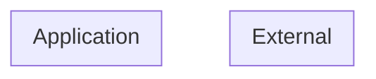

# Threat Model (auto-generated)

Generated by agentic-security on 2026-06-19.

This threat model is derived from static analysis of the current codebase and is regenerated on every scan. It is intended as a working artifact, not a finished compliance document.

## Entities + boundaries

## Assets

## STRIDE threats

### Tampering (2)

- [critical] **crypto-tls-no-verify** (CWE-295) at `run.py:72` — TLS certificate verification disabled — MITM-vulnerable
- [critical] **crypto-tls-no-verify** (CWE-295) at `run.py:73` — TLS certificate verification disabled — MITM-vulnerable

## Attack trees
