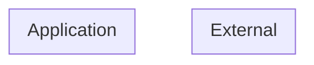

# Threat Model (auto-generated)

Generated by agentic-security on 2026-06-19.

This threat model is derived from static analysis of the current codebase and is regenerated on every scan. It is intended as a working artifact, not a finished compliance document.

## Entities + boundaries

## Assets

## STRIDE threats

### Tampering (1)

- [medium] **toctou-file-existence-permission-check-b** (CWE-367) at `run.py:254` — TOCTOU: file existence/permission check before open

### Information Disclosure (1)

- [medium] **crypto-weak-hash** (CWE-327) at `run.py:203` — Weak hash algorithm (MD5 / SHA-1 / MD2 / MD4) used

## Attack trees
