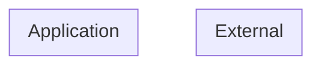

# Threat Model (auto-generated)

Generated by agentic-security on 2026-06-26.

This threat model is derived from static analysis of the current codebase and is regenerated on every scan. It is intended as a working artifact, not a finished compliance document.

## Entities + boundaries

## Assets

## STRIDE threats

### Tampering (2)

- [high] **agent-tool-escalation** (CWE-269) at `xorcism-mcp.mjs:50` — Agent Tool Privilege Escalation (act-tool "create_incident" exposed alongside read-tools)
- [high] **agent-tool-escalation** (CWE-269) at `xorcism-mcp.mjs:53` — Agent Tool Privilege Escalation (act-tool "compliance_posture" exposed alongside read-tools)

## Attack trees
